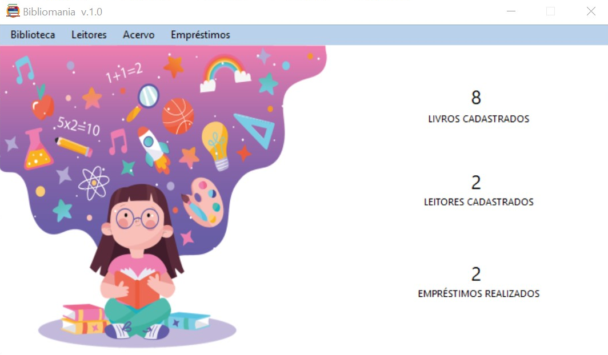
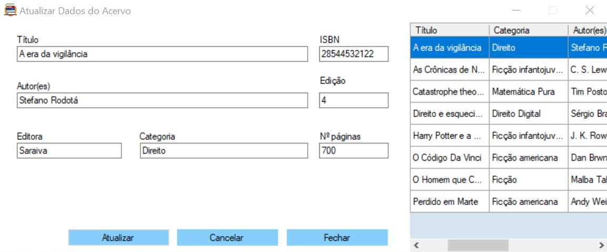
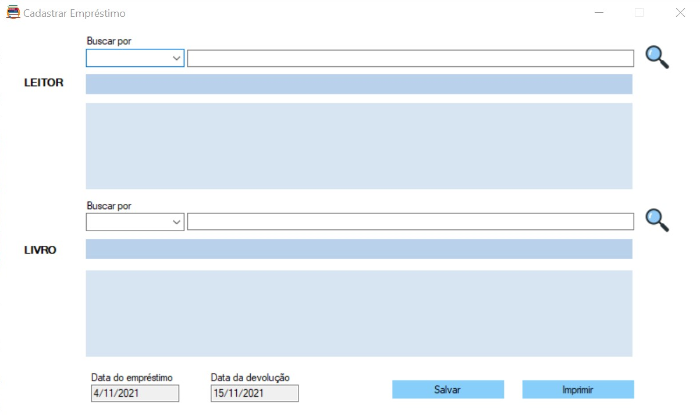
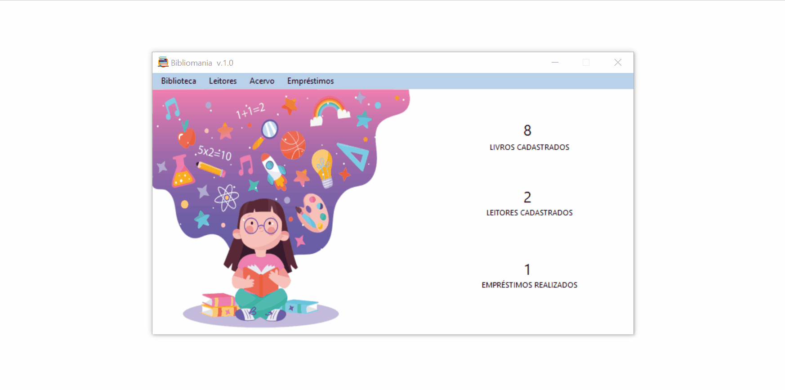

# Bibliomania
Aplicação para Gerenciamento de Biblioteca
> Versão **1.0** 

| [<br /><sub>HOME</sub>](src/HOME.png)<br /> |  [<br /><sub>ATUALIZAR DADOS DO ACERVO</sub>](src/Atualizar_DADOS_ACERVO.png)<br /> | [<br /><sub>CADASTRAR EMPRÉSTIMO</sub>](src/Cadastrar_EMPRESTIMO.png)<br /> |
| :---: | :---: | :---: |

---
### Descrição 📄

<div align="justify"> 
  
Sistema desenvolvido para uso de bibliotecários(as) com o intuito de auxiliar nas atividades de empréstimo e devolução de livros.

</div>

---
### Funcionalidades implementadas 📖

+ Cadastro de leitores
+ Validação de CPF
+ Atualização dos dados dos leitores
+ Exclusão de leitores do sistema 
+ Pesquisa personalizada dos leitores cadastrados 
+ Cadastro de livros
+ Validação de ISBN
+ Atualização dos dados do acervo
+ Exclusão de livros do acervo 
+ Consulta ao acervo da biblioteca 
+ Cadastro de empréstimos (com empréstimo de 7 dias)
+ Validação de empréstimo com base no ISBN do livro e CPF do leitor
+ Emissão de comprovante de empréstimo
+ Atualização dos dados do empréstimo
+ Exclusão de empréstimos 
+ Consulta aos empréstimos realizados
+ Controle do número de livros e leitores cadastrados no sistema
+ Controle do número de empréstimos realizados

### Funcionalidades em andamento :construction:

+ Acesso ao sistema por meio de *login* e senha
+ Notificação de efetuamento de empréstimo de livros (via email)
+ Notificão de alerta para a devolução de livros (via email à partir do 6º dia do prazo do empréstimo)
+ Visualização das categorias mais lidas 
+ Inserção da capa do livro durante cadastro
+ Inserção de lista de livros desejados pelos leitores (Wish-list ❤️)

---

### Tecnologias e Linguagens 💻

**Linguagem** 
<div style="display: inline_block">
  <a href="https://dotnet.microsoft.com/en-us/learn/csharp" target="_blank"> </a>
</div>


</br>

**Ambiente de Desenvolvimento** 
<div style="display: inline_block">
  <a href="https://visualstudio.microsoft.com/pt-br/" target="_blank"> </a>
  
</div>

</br>

**Database**
<div style="display: inline_block">
  <a href="https://www.sqlite.org/" target="_blank">  </a>
</div>

</br>

**Designing**

<a href="https://www.adobe.com/in/products/illustrator.html" target="_blank">  </a>

---


### Instalação ou Download do Projeto 🛠

Você pode fazer o <a href="https://github.com/arianacabral/Bibliomania.git">clone</a> do projeto

```bash
# Clone o repositório
$ git clone https://github.com/arianacabral/Bibliomania.git
```
ou, então, <a href = "https://github.com/arianacabral/Bibliomania/archive/refs/tags/v.1.0.zip">baixá-lo</a>. 

**Como rodar o código?**

<div align = "justify">
  Para rodar o projeto, você precisará ter o <a href="https://visualstudio.microsoft.com/pt-br/downloads/">Visual Studio</a> em sua máquina.
</div>

<br/>

> **ATENÇÃO!** Não se esqueça de garantir que as <a href="https://github.com/arianacabral/Bibliomania/tree/main/wfaGerenciamentoBiblioteca/packages">dependências</a> necessárias estão todas instaladas!

**Como executar a aplicação?**

<div>
Para executar o <strong>Bibliomania</strong> em sua máquina (💻), você precisará executar o arquivo <a href="https://github.com/arianacabral/Bibliomania/blob/main/wfaGerenciamentoBiblioteca/obj/Debug/wfaGerenciamentoBiblioteca.exe"> wfaGerenciamentoBiblioteca.exe</a>.
</div>

---

### Demo ✨

</br>

**Home**

<div align = "center" style="display: inline_block">
  
</div>

</br>

**Cadastro de leitores**

<div align = "center" style="display: inline_block">
  
</div>

</br>

**Atualizar dados dos leitores**

<div align = "center" style="display: inline_block">
  
</div>

---

### Contatos

Para mais informações ou dúvidas, entre em contato 😉

<div> 
  <a href="https://github.com/arianacabral" target="_blank"></a>
  <a href = "mailto:arianacabral57@ufu.br"></a>
  <a href="https://discord.gg/RTXE2NMVSA" target="_blank"></a> 
</div>

</br>
